```{r librariers, eval=TRUE}
suppressPackageStartupMessages({

  library(GenomicRanges)
  library(ggplot2)
  library(AnnotationHub)
  library(ensembldb)
  library(BiocParallel)
  library(edgeR)
  library(Rsamtools) 
  library(memes)
  library(ggbio)
  library(IRanges)
  library(magick)
  library(SummarizedExperiment) # structure to contain data+annotation
  library(sechm) # for plotting heatmaps from SummarizedExperiment objects
  library(Rsubread) # for counting reads
  library(patchwork) # for arranging plots together
  library(knitr)
  library(epiwraps)
  
  })
```
```{r setup, include=FALSE}
knitr::opts_chunk$set(echo = TRUE)
```

# The role of TDG for histone retention in sperm chromatin

## Introduction 

DNA is the source of genetic information and the blueprint of cells and therefore at the end for organisms. However, DNA is not floating freely in the nuclei of cells, but appears in the form of chromatin. Chromatin, as complex of DNA and DNA-bound proteins, is associated with regulation of gene expression by influencing the accessibility of the DNA. It was shown that that environmental stimuli can not only influence the behavior of the exposed organism but also its offspring [@ChamorroGarcia2017] [@Cunningham2021]. It is hypothesized that those environmental stimuli can change the accessibility of DNA in the germ lines of exposed organisms. Which again transfer the information to their offspring.
Various epigenetic marks are associated with the accessibility, most prominent are different post-translation modifications of histone marks, such as H3K27ac, H3K27me3 or H3K9me3 [@Bannister2011], or also well studied is the DNA methylation of 5C position of Cytosine (5mC), associated with active gene expression when apparent in the gene body and with in-active gene expression when apparent in the promoter region of protein-coding genes [@Greenberg2019]. DNA methylation is not the only modification, which is known to influence gene expression. The modified nucleotide 5’-formylcytosine (5fC) was found to form cross-links between DNA and proteins (histones) and interfere with DNA/RNA- polymerase binding. 5fC was shown to be enriched at poised enhancers and correlates with p300 binding [@Song2013], which itself was shown to be a histone acetylase, regulating transcription. Moreover it 5fC is positively correlated with nucleosome occupancy [@Raiber2018]. 5fC is produced from hydroxy methyl Cytosine by the TET enzymes. On the other hand it is again removed by the base excision repair enzyme TDG [@Koh2013]. It was shown that increasing this modification level by knocking out TDG possible in different cell/organ types [@Iurlaro2016] . Moreover, it was dmonstrated that 5fC immunohistochemical signal decreases with increasing maturity of sperm cells in testis [@Nettersheim2013], as they slowly undergo histone replacement. Therefore, we hypothesize that 5fC could play into the retention of histones in the densely packed sperm chromatin, which is shown in sperm when artificially increased.


## Methods{.tabset}

### General Methods

Heterozygous TDG_KO mice were used, due to lethality of homozygous deletion. Sperm was harvested from males by dissection of the epididymis and the vas deferens to select for fully developed sperm. 
100 000 sperm cells were used with the published omniATAC- protocol [@Corces2017], where Tn5 accessible genomic regions are fragmented, giving the information of overall accessibility in the sperm samples.
Sequencing was done with NovaSeq PE150 and a sequencing depth of 25G per sample.
Pre-processing was done with `trimmomatic`, `bowtie2`, partly `bamCoverage`, `alignmentSieve`, `macs2` peak caller.
Data analysis was done most prominently with the r package `epiwraps`.


### Pre-processing with bash

#### Pre-processing to generate bamfiles and bigwigfiles (no-exclusion of blacklist yet)
```{r, eval=FALSE}
ref=/reference/Mus_musculus/Ensembl/GRCm38/Sequence/BOWTIE2Index/genome
adapters=/conda/share/trimmomatic-0.38-1/adapters/TruSeqPE.fa
mkdir -p trimmed
mkdir -p aligned
mkdir -p tracks

for f in raw/*_1.fq.gz; do

base=`basename $f _1.fq.gz`
bam=aligned/"$base".bam

echo $base
trimdir=trimmed

if [ -f "$trimdir/"$base"_1.paired.fastq.gz" ]; then
  echo $trimdir/$base"_*fq.gz found; skipping"
else
trimmomatic PE -threads 6 -summary $trimdir/"$base".stats -phred33 raw/"$base"_1.fq.gz raw/"$base"_2.fq.gz $trimdir/"$base"_1.paired.fastq.gz $trimdir/"$base"_1.unpaired.fastq.gz $trimdir/"$base"_2.paired.fastq.gz $trimdir/"$base"_2.unpaired.fastq.gz ILLUMINACLIP:$adapters:2:15:4:4:true LEADING:20 TRAILING:20 SLIDINGWINDOW:4:15 MINLEN:25
fi

if [ -f "$bam" ]; then
    echo "$bam found; skipping"
else
(bowtie2 -p 6 --dovetail --no-mixed --no-discordant -I 15 -X 2000 -x $ref -1 $trimdir/"$base"_1.paired.fastq.gz -2 $trimdir/"$base"_2.paired.fastq.gz) 2> aligned/"$base".bowtie2 | samtools view -bS - | samtools sort -@4 -m 2G - > $bam

java -jar /common/picard.jar MarkDuplicates I=$bam O=$base.bam.2 M=aligned/$base.picard.dupMetrics.txt && mv $base.bam.2 $bam

samtools index $bam && rm $trimdir/"$base"_*.fastq.gz
fi

if [ -f "tracks/$base.bw" ]; then
    echo "tracks/$base.bw found; skipping"
else
  bamCoverage -p 6 --ignoreDuplicates --effectiveGenomeSize 2652783500 --normalizeUsing CPM --ignoreForNormalization MT -b aligned/"$base".bam -o tracks/$base.bw
fi

done
```


#### script for generating shifted, filtered (blacklist), nucleosome-free region bamfiles as well as macs2 peak calling for nucleosome-free region narrowPeaks and for total alignment broadpeaks 


```{r, eval=FALSE}
blacklist=/reference/Mus_musculus/mm10.blacklist.bed
mkdir -p NFbam
mkdir -p NFpeaks
mkdir -p peaks

for f in aligned/*.bam; do
base=`basename $f .bam`
echo $base
bam2=NFbam/$base.shifted.bam
if [ -f "$bam2" ]; then
  echo "$bam2 found, skipping..."
else
  alignmentSieve --blackListFileName $blacklist --ATACshift --filterMetrics NFbam/$base.filterMetrics --minMappingQuality 20 \
    --ignoreDuplicates --minFragmentLength 40 --maxFragmentLength 115 -p 8 -b $f -o /dev/stdout | samtools sort -@ 4 -m 1G - > $bam2
  samtools index $bam2
fi
if [ -f NFpeaks/$base"_peaks.narrowPeak" ]; then
 echo "Peaks found for $base, skipping..."
else
 macs2 callpeak --call-summits -g mm -f BAMPE --name NFpeaks/$base -t $bam2
  macs2 callpeak --broad -g mm -f BAMPE --name peaks/$base -t $f
fi
done

```


## Results{.tabset}

### Quality Control of Data{.tabset}

#### Control of read fragments Distribution and alignment rates{.tabset}
The plots for the fragment size distributions were plotted with `ATACseqQC::fragSizeDist`.
```{r listing_of_bamfiles_and_renaming, eval=FALSE}
bam_tdg <- list.files("/mnt/bohacek/kathi/vincent/ATAC_tdg_Ko/aligned/", pattern = "bam$")

bam_tdg.labels <- gsub(".{34}$", "", basename(bam_tdg[1:5])) # 34 for is length of string I want to get rid of
```
fragmentsizeplot
```{r fragmentsizeplot, eval=FALSE}
ATACseqQC::fragSizeDist(bam_tdg[1:5],bam_tdg.labels)
```
Overall fragment size distribution looks as expected for all of the samples. We can se clearly the difference between nucleosome-free regions and mono- and polynucleosome regions. Remarkable is the strong dent between the regions. In general there seems to be a strong technical difference between the Tdg_KO and the Ctrl samples. The controls have less reads in the NF fragment size regions compared to the Tdg samples. 
The overall alignment rate varied between samples (62%- 78%) and is lower than the suggested rate of 95% by encode. 

##### Ctrl_M1

```{r,  include=TRUE, fig.align="center", fig.cap=c("Fragment size distribution plot of Ctrl_M1"),out.width = '100%', echo=FALSE}
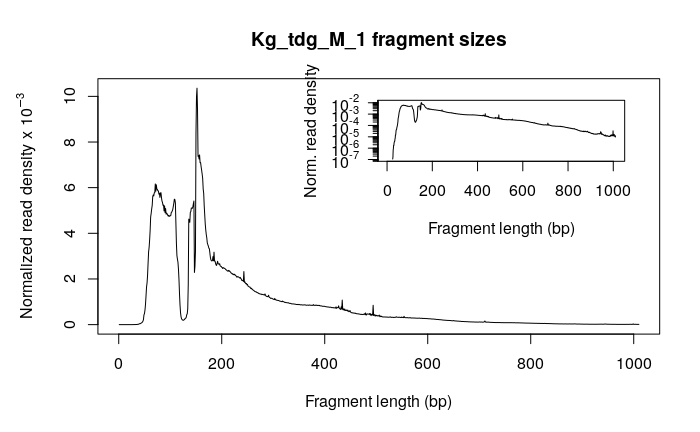
```

Alignment metric:<br>
114882629 reads; of these:<br>
  114882629 (100.00%) were paired; of these:<br>
    42209286 (36.74%) aligned concordantly 0 times<br>
    58515777 (50.94%) aligned concordantly exactly 1 time<br>
    14157566 (12.32%) aligned concordantly >1 times<br>
63.26% overall alignment rate<br>


##### Ctrl_M3

```{r,  include=TRUE, fig.align="center", fig.cap=c("Fragment size distribution plot of Ctrl_M3"),out.width = '100%', echo=FALSE}
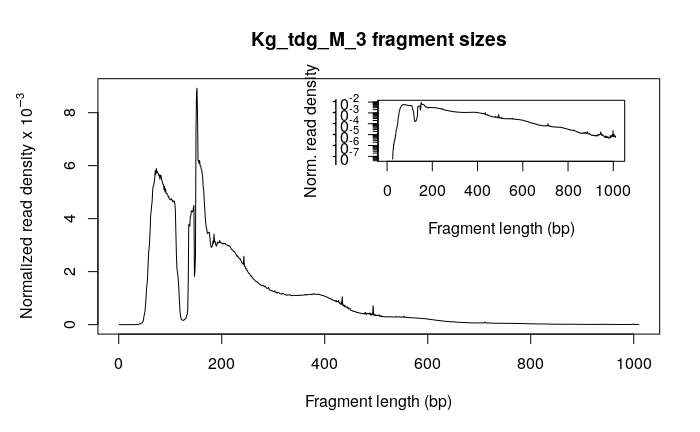
```

111114217 reads; of these:<br>
  111114217 (100.00%) were paired; of these:<br>
    23653148 (21.29%) aligned concordantly 0 times<br>
    71104014 (63.99%) aligned concordantly exactly 1 time<br>
    16357055 (14.72%) aligned concordantly >1 times<br>
78.71% overall alignment rate


##### Tdg_KO1

```{r,  include=TRUE, fig.align="center", fig.cap=c("Fragment size distribution plot of Tdg_KO1"),out.width = '100%', echo=FALSE}
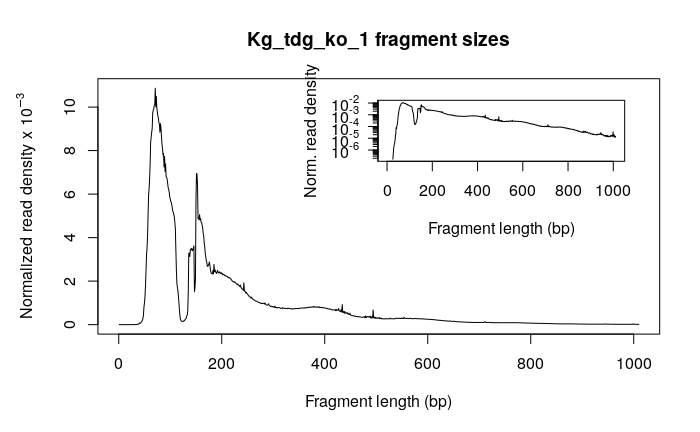
```

86016621 reads; of these: <br>
  86016621 (100.00%) were paired; of these:<br>
    21451208 (24.94%) aligned concordantly 0 times<br>
    51176257 (59.50%) aligned concordantly exactly 1 time<br>
    13389156 (15.57%) aligned concordantly >1 times<br>
75.06% overall alignment rate

##### Tdg_KO2

```{r,  include=TRUE, fig.align="center", fig.cap=c("Fragment size distribution plot of Tdg_KO2"),out.width = '100%', echo=FALSE}

```

93729935 reads; of these:<br>
  93729935 (100.00%) were paired; of these:<br>
    35542740 (37.92%) aligned concordantly 0 times<br>
    46747534 (49.87%) aligned concordantly exactly 1 time<br>
    11439661 (12.20%) aligned concordantly >1 times<br>
62.08% overall alignment rate


##### Tdg_KO3

```{r,  include=TRUE, fig.align="center", fig.cap=c("Fragment size distribution plot of Tdg_KO3"),out.width = '100%', echo=FALSE}

```

108813536 reads; of these:<br>
  108813536 (100.00%) were paired; of these:<br>
    33732903 (31.00%) aligned concordantly 0 times<br>
    59957723 (55.10%) aligned concordantly exactly 1 time<br>
    15122910 (13.90%) aligned concordantly >1 times<br>
69.00% overall alignment rate

#### Initial Control for Technical  signal to noise ratio differences by looking at MAplots and Heatscatter plots of full bams and broadPeaks{.tabset}

control_for_signal_to_noise_ratio
```{r control_for_signal_to_noise_ratio, eval=FALSE}
getwd()
bamfiles <- list.files("aligned", pattern="bam$", full=TRUE)
# we give the samples clean names:
names(bamfiles) <- gsub(".{34}$","", x = bamfiles)

bamfiles <- c(bamfiles[4],bamfiles[5],bamfiles[1],bamfiles[2],bamfiles[3])

bamfiles
```
```{r consensus broad peaks, eval=FALSE}
bpT1 <- rtracklayer::import("/mnt/bohacek/kathi/vincent/ATAC_tdg_Ko/peaks/Kg_tdg_ko_1_EKDL220000948-1a_H22J7DSX3_L2_peaks.broadPeak")
bpT2 <- rtracklayer::import("/mnt/bohacek/kathi/vincent/ATAC_tdg_Ko/peaks/Kg_tdg_ko_2_EKDL220003833-1a_HJ5T2DSX3_L1_peaks.broadPeak")
bpT3 <- rtracklayer::import("/mnt/bohacek/kathi/vincent/ATAC_tdg_Ko/peaks/Kg_tdg_ko_3_EKDL220003834-1a_HJ5T2DSX3_L1_peaks.broadPeak")
bpM1 <- rtracklayer::import("/mnt/bohacek/kathi/vincent/ATAC_tdg_Ko/peaks/Kg_tdg_M_1_EKDL220003835-1a_HJ5T2DSX3_L1_peaks.broadPeak")
bpM3 <- rtracklayer::import("/mnt/bohacek/kathi/vincent/ATAC_tdg_Ko/peaks/Kg_tdg_M_3_EKDL220003836-1a_HJ5T2DSX3_L1_peaks.broadPeak")

peak_list <- c(bpM1,bpM3,bpT1,bpT2,bpT3)

seqlevelsStyle(bpT1)
merged_bpeaks <- reduce(unlist(GRangesList(peak_list)), with.revmap=TRUE)
y <- keepStandardChromosomes(merged_bpeaks, pruning.mode = "coarse")
merged_bpeaks <- granges(y[lengths(y$revmap)>1])
blacklist <- import("/reference/Mus_musculus/mm10.blacklist_chrM.bed")
seqlevelsStyle(blacklist) <- "ensembl"
merged_bpeaks <- merged_bpeaks[!overlapsAny(merged_bpeaks, blacklist)]# thats how you get rid of blacklisted peaks!!!!
merged_bpeaks
```
```{r generating counts per peaks and se object, eval=FALSE}

anno <- cbind(name=as.character(merged_bpeaks), as.data.frame(merged_bpeaks))
anno$width <- NULL
colnames(anno) <- c("GeneID", "Chr", "Start", "End", "Strand")
fc <- featureCounts( files=bamfiles,    # the files in which we want to count reads
                     isPairedEnd=TRUE,
                     annot.ext=anno,    # the regions in which we want to count reads
                     readExtension3=50, # extend the reads by 50bp
                     nthreads=3         # multithreading (to speed up)
                    )
saveRDS(fc, file = "fc.RDS") 
se <- SummarizedExperiment(assays=list(counts=fc$counts), rowRanges=merged_bpeaks )
```

##### Comparison M1M3
```{r,eval=FALSE}
edgeR::maPlot(assay(se)[,1], assay(se)[,2], lowess=TRUE, ylab="M (log2 foldchange)", 
              xlab="A (mean log-count)"); abline(h=0, lty="dashed")
LSD::heatscatter(log1p(rowMeans(assay(se)[,c(1,2)])), log1p(assay(se)[,1])-log1p(assay(se)[,2]), ylim=c(-3,1.5), xlim=c(1,7))
```
To check for signal to noise ratio differences between the samples an MAplot was generated and depending on the result a Heatscatterplot as well. The MAplot for M1_M3 is difficult to interpret but the Heatscatterplot shows clearly homogenity between the samples
```{r,  include=TRUE, fig.align="center", fig.cap=c("MAplot with M1_M3"),out.width = '100%', echo=FALSE}
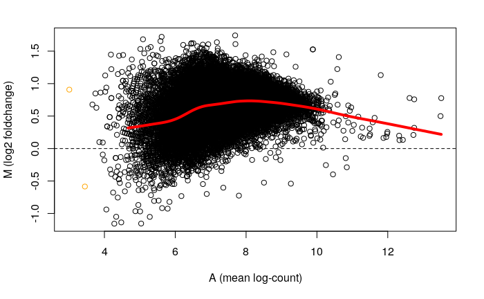
```
```{r,  include=TRUE, fig.align="center", fig.cap=c("Heatscatterplot with M1_M3"),out.width = '100%', echo=FALSE}
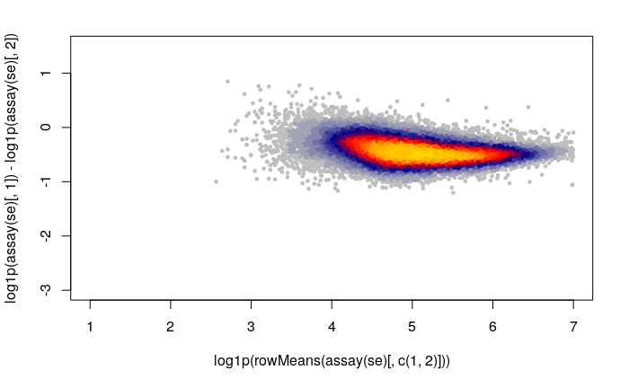
```

##### Comparison M1KO1
```{r,eval=FALSE}
edgeR::maPlot(assay(se)[,1], assay(se)[,3], lowess=TRUE, ylab="M (log2 foldchange)", 
              xlab="A (mean log-count)"); abline(h=0, lty="dashed")
LSD::heatscatter(log1p(rowMeans(assay(se)[,c(1,3)])), log1p(assay(se)[,1])-log1p(assay(se)[,3]), ylim=c(-3,1.5), xlim=c(1,7))
```
To check for signal to noise ratio differences between the samples an MAplot was generated and depending on the result a Heatscatterplot as well. Both plots show the differences in signal to noise ratio.
```{r,  include=TRUE, fig.align="center", fig.cap=c("MAplot with M1_KO1"),out.width = '100%', echo=FALSE}
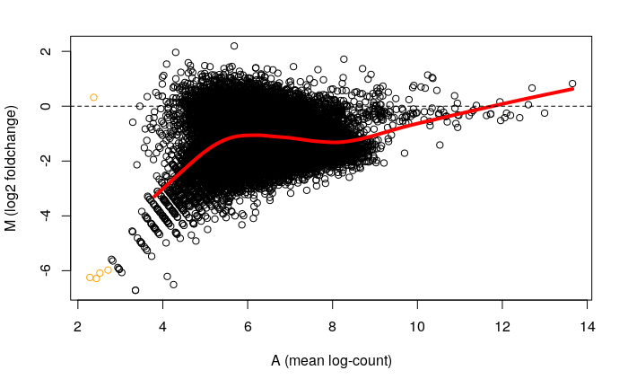
```
```{r,  include=TRUE, fig.align="center", fig.cap=c("Heatscatterplot with M1_M3"),out.width = '100%', echo=FALSE}
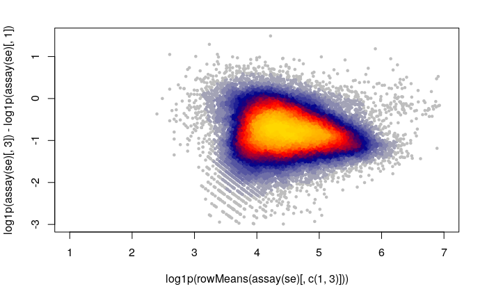
```

##### Comparison M1KO2
```{r,eval=FALSE}
edgeR::maPlot(assay(se)[,1], assay(se)[,4], lowess=TRUE, ylab="M (log2 foldchange)", 
              xlab="A (mean log-count)"); abline(h=0, lty="dashed")

```
To check for signal to noise ratio differences between the samples an MAplot was generated and depending on the result a Heatscatterplot as well. Similiar results to MAplot of M1KO1
```{r,  include=TRUE, fig.align="center", fig.cap=c("MAplot with M1_KO2"),out.width = '100%', echo=FALSE}
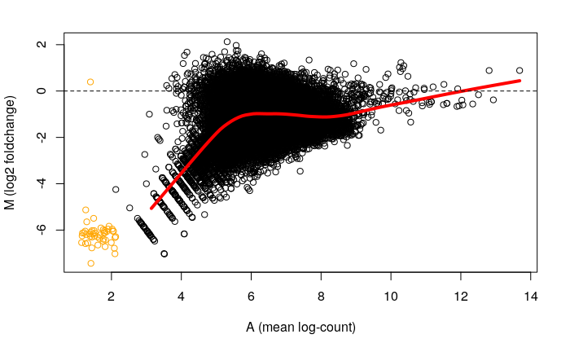
```

##### Comparison KO1KO2
```{r,eval=FALSE}
edgeR::maPlot(assay(se)[,3], assay(se)[,4], lowess=TRUE, ylab="M (log2 foldchange)", 
              xlab="A (mean log-count)"); abline(h=0, lty="dashed")

```
To check for signal to noise ratio differences between the samples an MAplot was generated and depending on the result a Heatscatterplot as well. The MAplot shows that the signal to noise ratio is similiar in the samples.
```{r,  include=TRUE, fig.align="center", fig.cap=c("MAplot with KO1_KO2"),out.width = '100%', echo=FALSE}
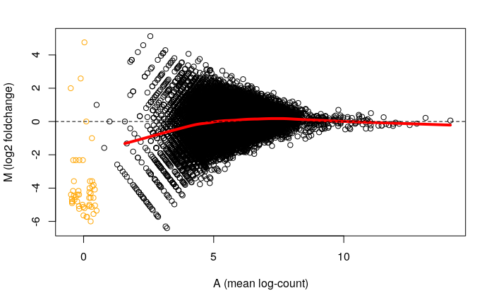
```

##### Comparison KO1KO3
```{r,eval=FALSE}
edgeR::maPlot(assay(se)[,3], assay(se)[,5], lowess=TRUE, ylab="M (log2 foldchange)", 
              xlab="A (mean log-count)"); abline(h=0, lty="dashed")

```
To check for signal to noise ratio differences between the samples an MAplot was generated and depending on the result a Heatscatterplot as well. The MAplot shows that the signal to noise ratio is similiar in the samples.
```{r,  include=TRUE, fig.align="center", fig.cap=c("MAplot with KO1_KO3"),out.width = '100%', echo=FALSE}
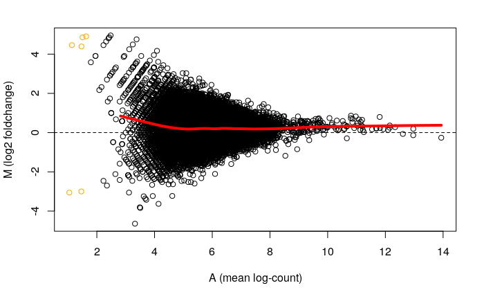
```

#### Signal to noise ration control in nucleosome-free region bams and narrowPeaks{.tabset}
```{r loading_NFbam_NFpeaks, eval=FALSE}
tdg_nfp1 <- rtracklayer::import("NFpeaks/Kg_tdg_ko_1_EKDL220000948-1a_H22J7DSX3_L2_peaks.narrowPeak")
tdg_nfp2 <- rtracklayer::import("NFpeaks/Kg_tdg_ko_2_EKDL220003833-1a_HJ5T2DSX3_L1_peaks.narrowPeak")
tdg_nfp3 <- rtracklayer::import("NFpeaks/Kg_tdg_ko_3_EKDL220003834-1a_HJ5T2DSX3_L1_peaks.narrowPeak")
ctrl_nfp1 <- rtracklayer::import("NFpeaks/Kg_tdg_M_1_EKDL220003835-1a_HJ5T2DSX3_L1_peaks.narrowPeak")
ctrl_nfp3 <- rtracklayer::import("NFpeaks/Kg_tdg_M_3_EKDL220003836-1a_HJ5T2DSX3_L1_peaks.narrowPeak")

merged_nfpeaks <- reduce(unlist(GRangesList(c(ctrl_nfp1,ctrl_nfp3,tdg_nfp1,tdg_nfp2,tdg_nfp3))), with.revmap=TRUE)
y <- keepStandardChromosomes(merged_nfpeaks, pruning.mode = "coarse")
merged_nfpeaks <- granges(y[lengths(y$revmap)>1])
blacklist <- import("/reference/Mus_musculus/mm10.blacklist_chrM.bed")
seqlevelsStyle(blacklist) <- "ensembl"
merged_nfpeaks <- merged_nfpeaks[!overlapsAny(merged_nfpeaks, blacklist)]# thats how you get rid of blacklisted peaks!!!!
merged_nfpeaks

bamfiles <- list.files("NFbam", pattern="bam$", full=TRUE)
# we give the samples clean names:
names(bamfiles) <- gsub(".{42}$","", x = bamfiles)

bamfiles <- c(bamfiles[4],bamfiles[5],bamfiles[1],bamfiles[2],bamfiles[3])

bamfiles
```
```{r counts per peaks for NF and se, eval=FALSE}
anno_nf <- cbind(name=as.character(merged_nfpeaks), as.data.frame(merged_nfpeaks))
anno_nf$width <- NULL
colnames(anno_nf) <- c("GeneID", "Chr", "Start", "End", "Strand")
fc_nf <- featureCounts( files=bamfiles,    # the files in which we want to count reads
                     isPairedEnd=TRUE,
                     annot.ext=anno_nf,    # the regions in which we want to count reads
                     readExtension3=50, # extend the reads by 50bp
                     nthreads=3         # multithreading (to speed up)
                    )

saveRDS(fc_nf, file = "fc_nf.RDS") 
se_nf <- SummarizedExperiment(assays=list(counts=fc_nf$counts), rowRanges=merged_nfpeaks )
```

##### Comparison M1M3 for NF
```{r,eval=FALSE}
edgeR::maPlot(assay(se_nf)[,1], assay(se_nf)[,2], lowess=TRUE, ylab="M (log2 foldchange)", 
              xlab="A (mean log-count)"); abline(h=0, lty="dashed")
```
To check for signal to noise ratio differences between the samples an MAplot was created. The MAplot shows that the signal to noise ratio is similiar in the control samples when only using nucleosome-free region information.
```{r,  include=TRUE, fig.align="center", fig.cap=c("MAplot with M1_M2_NF"),out.width = '100%', echo=FALSE}
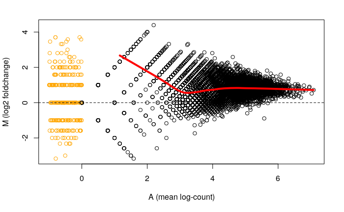
```

##### Comparison M1KO1 for NF
```{r,eval=FALSE}
edgeR::maPlot(assay(se_nf)[,1], assay(se_nf)[,3], lowess=TRUE, ylab="M (log2 foldchange)", 
              xlab="A (mean log-count)"); abline(h=0, lty="dashed")

```
To check for signal to noise ratio differences between the samples an MAplot was created. The MAplot shows that the signal to noise ratio is similiar in the samples when only using nucleosome-free region information also when comparing control with Tdg knockout samples.
```{r,  include=TRUE, fig.align="center", fig.cap=c("MAplot with M1_KO1_NF"),out.width = '100%', echo=FALSE}
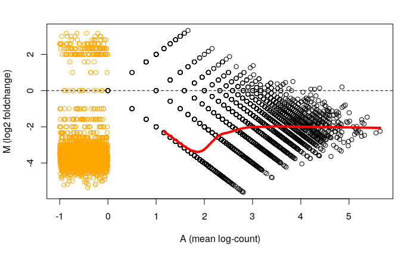
```

##### Comparison M1KO2 for NF
```{r, eval =FALSE}
edgeR::maPlot(assay(se_nf)[,1], assay(se_nf)[,4], lowess=TRUE, ylab="M (log2 foldchange)", 
              xlab="A (mean log-count)"); abline(h=0, lty="dashed")

```
To check for signal to noise ratio differences between the samples an MAplot was created. The MAplot shows that the signal to noise ratio is similiar in the samples when only using nucleosome-free region information also when comparing control with Tdg knockout samples.
```{r,  include=TRUE, fig.align="center", fig.cap=c("MAplot with M1_KO2_NF"),out.width = '100%', echo=FALSE}

```

##### Comparison M1KO3 for NF
```{r, eval=FALSE}

edgeR::maPlot(assay(se_nf)[,1], assay(se_nf)[,5], lowess=TRUE, ylab="M (log2 foldchange)", 
              xlab="A (mean log-count)"); abline(h=0, lty="dashed")

```
To check for signal to noise ratio differences between the samples an MAplot was created. The MAplot shows that the signal to noise ratio is similiar in the samples when only using nucleosome-free region information also when comparing control with Tdg knockout samples.
```{r,  include=TRUE, fig.align="center", fig.cap=c("MAplot with M1_KO3_NF"),out.width = '100%', echo=FALSE}
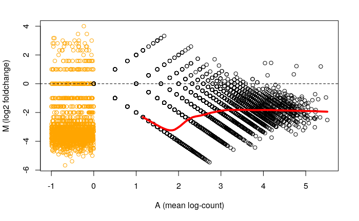
```

##### Comparison KO1KO2 for NF
```{r, eval=FALSE}
edgeR::maPlot(assay(se_nf)[,3], assay(se_nf)[,4], lowess=TRUE, ylab="M (log2 foldchange)", 
              xlab="A (mean log-count)"); abline(h=0, lty="dashed")
```
To check for signal to noise ratio differences between the samples an MAplot was created. The MAplot shows that the signal to noise ratio is similiar in the samples when only using nucleosome-free region information also when the Tdg knockout samples between each other.
```{r,  include=TRUE, fig.align="center", fig.cap=c("MAplot with KO1_KO2_NF"),out.width = '100%', echo=FALSE}
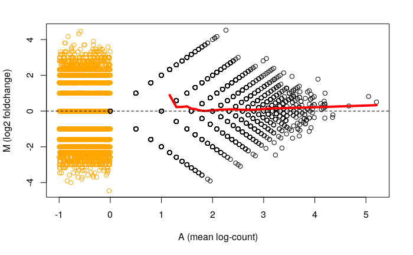
```


### Comparison of Control and Tdg_KO looking at peaks for 5fC in sperm{.tabset}

#### EnrichedHeatMap without normalization for bamCoverage generated bigwigfiles (no filter)
```{r Peak import and matrix generation,eval=FALSE}
p5fc <- import("/mnt/bohacek/kathi/KG_from_victor/5fC_MACS2_2020-01-06--08-56-55/merged.bed")
m_tdg <- signal2Matrix(c(ATAC_Tdg3="/mnt/bohacek/kathi/vincent/ATAC_tdg_Ko/tracks/Kg_tdg_ko_3_EKDL220003834-1a_HJ5T2DSX3_L1.bw", ATAC_Tdg2 ="/mnt/bohacek/kathi/vincent/ATAC_tdg_Ko/tracks/Kg_tdg_ko_2_EKDL220003833-1a_HJ5T2DSX3_L1.bw", ATAC_Tdg1 = "/mnt/bohacek/kathi/vincent/ATAC_tdg_Ko/tracks/Kg_tdg_ko_1_EKDL220000948-1a_H22J7DSX3_L2.bw"), p5fc)
m_ctrl <- signal2Matrix(c(ctrl_M1="/mnt/bohacek/kathi/vincent/ATAC_tdg_Ko/tracks/Kg_tdg_M_1_EKDL220003835-1a_HJ5T2DSX3_L1.bw", ctrl_M3 ="/mnt/bohacek/kathi/vincent/ATAC_tdg_Ko/tracks/Kg_tdg_M_3_EKDL220003836-1a_HJ5T2DSX3_L1.bw"), p5fc)
```
```{r generating EnrichedHeatMap without normalization plot,eval=FALSE}
plotEnrichedHeatmaps(c(m_ctrl,m_tdg))
```
```{r,  include=TRUE, fig.align="center", fig.cap=c("EnrichedHeatMap of total accessibility information and 5fC peaks"),out.width = '100%', echo=FALSE}
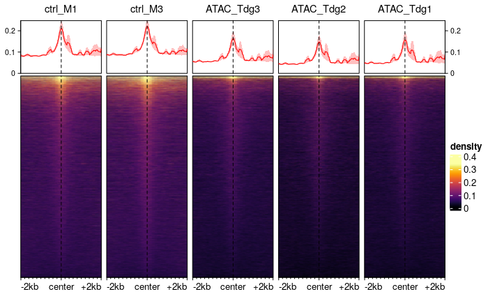
```
Plot shows that TDG_KO samples show overall lower accessibility in 5fC peak regions. However, no normalization was done and results of MAplots have to be considered

#### EnrichedHeatMap with background normalization for bamCoverage generated bigwigfiles (no filter)
```{r generation of background normalization factor, eval=FALSE}
nf <- bwNormFactors(c(ctrl_M1="/mnt/bohacek/kathi/vincent/ATAC_tdg_Ko/tracks/Kg_tdg_M_1_EKDL220003835-1a_HJ5T2DSX3_L1.bw", ctrl_M3 ="/mnt/bohacek/kathi/vincent/ATAC_tdg_Ko/tracks/Kg_tdg_M_3_EKDL220003836-1a_HJ5T2DSX3_L1.bw", ATAC_Tdg1 = "/mnt/bohacek/kathi/vincent/ATAC_tdg_Ko/tracks/Kg_tdg_ko_1_EKDL220000948-1a_H22J7DSX3_L2.bw", ATAC_Tdg2 ="/mnt/bohacek/kathi/vincent/ATAC_tdg_Ko/tracks/Kg_tdg_ko_2_EKDL220003833-1a_HJ5T2DSX3_L1.bw", ATAC_Tdg3="/mnt/bohacek/kathi/vincent/ATAC_tdg_Ko/tracks/Kg_tdg_ko_3_EKDL220003834-1a_HJ5T2DSX3_L1.bw"))


bwNorm_n_m <- rescaleSignalMatrices(n_m,scaleFactors = nf )
```
```{r generating EnrichedHeatMap with background normalization plot, eval=FALSE}
plotEnrichedHeatmaps(bwNorm_n_m)
```
```{r,  include=TRUE, fig.align="center", fig.cap=c("EnrichedHeatMap of total accessibility information and 5fC peaks with background normalization"),out.width = '100%', echo=FALSE}
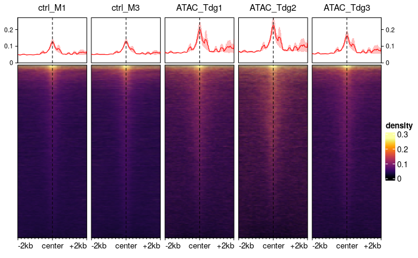
```
Plot shows inverse of previous plot, where no normalization as used. However, results of MAplots have to be considered.

### EnrichedHeatMaps for total_consensus_NF_peaks{.tabset}

To exclude blacklisted and MT reads bam files were create with `bam2bw` with exclusion list. In the same function loop bw files for NF coverage (Fragmentation length 30-115) and Mononucleosome coverage (Fragmentation length 130-220) were created. Additionally to the coverage bw files for cuts were created.

generation of bigwig files with bam2bw
```{r generation of bigwig files with bam2bw, eval=FALSE}
getwd()
for(f in list.files("aligned/", pattern="bam$", full=TRUE)){
  bam2bw(f, paste0("tracks/", gsub(".{34}$",".full.bw",basename(f))), paired=TRUE, binWidth=1L, exclude=blacklist, BPPARAM = 8)
  bam2bw(f, paste0("tracks/", gsub(".{34}$",".NF.bw",basename(f))), paired=TRUE, binWidth=1L, exclude=blacklist, minFragLength=30, maxFragLength=115, BPPARAM = 8)
  bam2bw(f, paste0("tracks/", gsub(".{34}$",".mono.bw",basename(f))), paired=TRUE, binWidth=1L, exclude=blacklist, minFragLength=130, maxFragLength=220, BPPARAM = 8)
  bam2bw(f, paste0("tracks/", gsub(".{34}$",".cuts_full.bw",basename(f))), paired=TRUE, binWidth=1L, type="ends", exclude=blacklist, BPPARAM = 8)
  bam2bw(f, paste0("tracks/", gsub(".{34}$",".cuts_NF.bw",basename(f))), paired=TRUE, binWidth=1L, type="ends", exclude=blacklist, minFragLength=30, maxFragLength=115, BPPARAM = 8)
  bam2bw(f, paste0("tracks/", gsub(".{34}$",".cuts_mono.bw",basename(f))), paired=TRUE, binWidth=1L, type="ends", exclude=blacklist, minFragLength=130, maxFragLength=220, BPPARAM = 8)
}
```

track list preparation (duplicates still included)
```{r track list preparation (duplicates still included), eval=FALSE}
tdg_nf <- list.files("tracks/", pattern = "^Kg_tdg_ko(.*)\\.NF.bw$", full =TRUE)
tdg_nf_cuts <-list.files("tracks/", pattern = "^Kg_tdg_ko(.*)\\cuts_NF.bw$",full =TRUE)
tdg_mono <- list.files("tracks/", pattern = "^Kg_tdg_ko(.*)\\.mono.bw$",full =TRUE)
tdg_mono_cuts <- list.files("tracks/", pattern = "^Kg_tdg_ko(.*)\\cuts_mono.bw$",full =TRUE)
tdg_full <- list.files("tracks/", pattern = "^Kg_tdg_ko(.*)\\.full.bw$",full =TRUE)
tdg_full_cuts <- list.files("tracks/", pattern = "^Kg_tdg_ko(.*)\\cuts_full.bw$", full =TRUE)
ctrl_nf <- list.files("tracks/", pattern = "^Kg_tdg_M(.*)\\.NF.bw$", full =TRUE)
ctrl_nf_cuts <- list.files("tracks/", pattern = "^Kg_tdg_M(.*)\\cuts_NF.bw$",full =TRUE)
ctrl_mono <- list.files("tracks/", pattern = "^Kg_tdg_M(.*)\\.mono.bw$",full =TRUE)
ctrl_mono_cuts <- list.files("tracks/", pattern = "^Kg_tdg_M(.*)\\cuts_mono.bw$",full =TRUE)
ctrl_full <- list.files("tracks/", pattern = "^Kg_tdg_M(.*)\\.full.bw$",full =TRUE)
ctrl_full_cuts <- list.files("tracks/", pattern = "^Kg_tdg_M(.*)\\cuts_full.bw$",full =TRUE)

names(ctrl_nf) <- c("ctrl_M1","ctrl_M3")
names(tdg_nf) <- c("Tdg_KO1","Tdg_KO2","Tdg_KO3")
names(ctrl_nf_cuts) <- c("ctrl_M1","ctrl_M3")
names(tdg_nf_cuts) <- c("Tdg_KO1","Tdg_KO2","Tdg_KO3")
names(ctrl_mono) <- c("ctrl_M1","ctrl_M3")
names(tdg_mono) <- c("Tdg_KO1","Tdg_KO2","Tdg_KO3")
names(ctrl_mono_cuts) <- c("ctrl_M1","ctrl_M3")
names(tdg_mono_cuts) <- c("Tdg_KO1","Tdg_KO2","Tdg_KO3")
names(ctrl_full_cuts) <- c("ctrl_M1","ctrl_M3")
names(tdg_full_cuts) <- c("Tdg_KO1","Tdg_KO2","Tdg_KO3")
```

import of peaks and generation of consensus NFpeaks
```{r import of peaks and generation of consensus NFpeaks, eval=FALSE}
pT1 <- rtracklayer::import("/mnt/bohacek/kathi/vincent/ATAC_tdg_Ko/NFpeaks/Kg_tdg_ko_1_EKDL220000948-1a_H22J7DSX3_L2_peaks.narrowPeak")
pT2 <- rtracklayer::import("/mnt/bohacek/kathi/vincent/ATAC_tdg_Ko/NFpeaks/Kg_tdg_ko_2_EKDL220003833-1a_HJ5T2DSX3_L1_peaks.narrowPeak")
pT3 <- rtracklayer::import("/mnt/bohacek/kathi/vincent/ATAC_tdg_Ko/NFpeaks/Kg_tdg_ko_3_EKDL220003834-1a_HJ5T2DSX3_L1_peaks.narrowPeak")

pM1 <- rtracklayer::import("/mnt/bohacek/kathi/vincent/ATAC_tdg_Ko/NFpeaks/Kg_tdg_M_1_EKDL220003835-1a_HJ5T2DSX3_L1_peaks.narrowPeak")
pM3 <- rtracklayer::import("/mnt/bohacek/kathi/vincent/ATAC_tdg_Ko/NFpeaks/Kg_tdg_M_3_EKDL220003836-1a_HJ5T2DSX3_L1_peaks.narrowPeak")

merged_peaks <- reduce(unlist(GRangesList(c(pM1,pM3,pT1,pT2,pT3))), with.revmap=TRUE)
merged_peaks <- granges(merged_peaks[lengths(merged_peaks$revmap)>1])
```

#### EnrichedHeatMap with total_consensus_NFpeaks for total bam coverage(bam2bw)


generation of matrix (background normalized) with full coverage bw files and NFpeaks
```{r generation of matrix (background normalized) with full coverage bw files and NFpeaks, eval=FALSE}
m_allpeaks <- signal2Matrix(c(ctrl_full, tdg_full), merged_peaks,  w =1)
nf_bam2bw_full <- bwNormFactors(c(ctrl_full, tdg_full))
nm_m_allpeaks <- rescaleSignalMatrices(m_allpeaks,scaleFactors = nf_bam2bw_full)
```

generation of EnrichedHeatMap for full coverage bw and NFpeaks (background normalized)
```{r generation of EnrichedHeatMap for full coverage bw and NFpeaks (background normalized), eval =FALSE}
plotEnrichedHeatmaps(ml = nm_m_allpeaks, raster_resize_mat = TRUE, scale_title = "Full_bam2bw_density(norm.)", row_title="Total_Consensus_Peaks")
```

```{r,  include=TRUE, fig.align="center", fig.cap=c("EnrichedHeatMap of total accessibility information for consensus peaks. Plot was normalized to background. "),out.width = '100%', echo=FALSE}
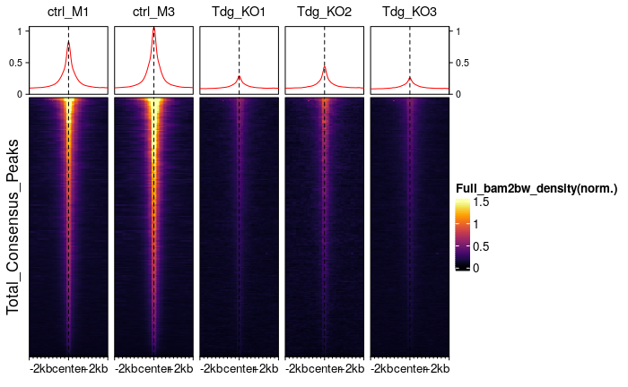
```
The total accessibility of the full coverage at the consensus peaks of the nucleosome-free regions is reduced in Tdg_KO samples. However, it should be kept in mind what the results have been of the MAplots which demonstrates differences between the full coverage information of the samples.

#### EnrichedHeatMap with total_consensus_NFpeaks for nucleosome-free bam coverage(bam2bw){.tabset}

Generation of signal matrix and normalization factors
```{r Generation of signal matrix and normalization factors, eval=FALSE}
m_nf_total <- signal2Matrix(c(ctrl_nf, tdg_nf), merged_peaks)
nf_nf <- bwNormFactors(c(ctrl_nf, tdg_nf), nwind = 40000L)
nm_m_nf_total <- rescaleSignalMatrices(m_nf_total,scaleFactors = nf_nf )
```

##### Non-normalized

EnrichedHeatmap for non-normalized plot NFbw coverage and consensus NFpeaks
```{r EnrichedHeatmap for non-normalized plot NFbw coverage and consensus NFpeaks, eval=FALSE}
tot_peak_sub_cov_list <- list("Total_Consensus_Peaks_NF_bam2bw " = m_nf_total) #, "Total_Consensus_Peaks_Mono_bam2bw "= m_mono_total,"Total_Consensus_Peaks_NF_cuts_bam2bw " = m_nf_cuts_total, "Total_Consensus_Peaks_Mono_cuts_bam2bw "=  m_mono_cuts_total)
plotEnrichedHeatmaps(ml = tot_peak_sub_cov_list[[1]], raster_resize_mat = TRUE,scale_title = paste(names(tot_peak_sub_cov_list[1])), row_title="Total_Consensus_Peaks")
```

```{r,  include=TRUE, fig.align="center", fig.cap=c("EnrichedHeatMap of accessibility of nucleosome-free fragments information and nucleosome-free consensus peaks."),out.width = '100%', echo=FALSE}
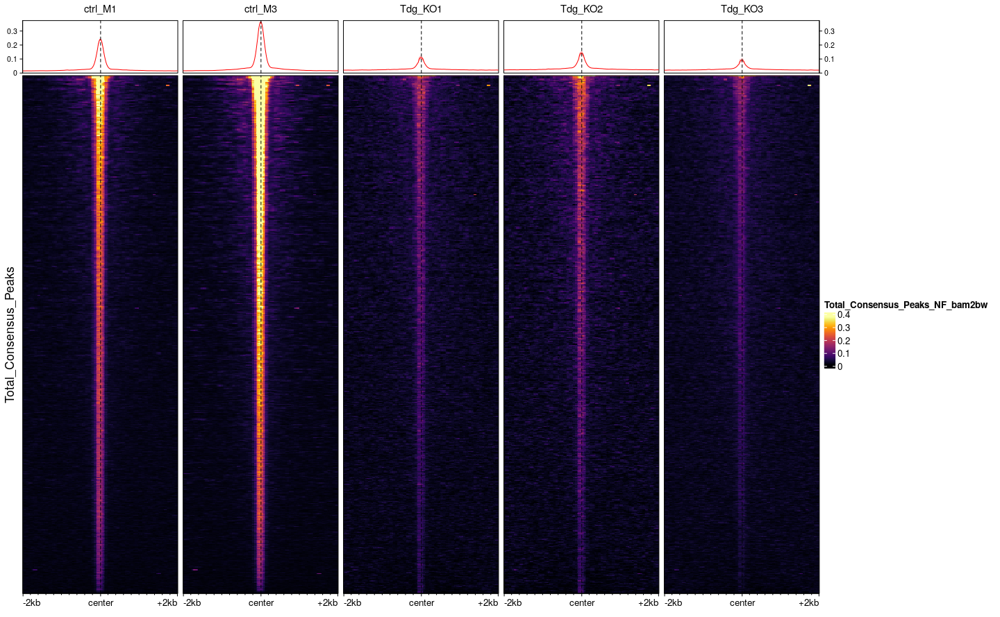
```
Plotting the NFbw coverage to the consensus NFpeaks as EnrichedHeatmap illustrates that the Tdg_KO samples show less accessibility in the regions looked at.

##### Normalized to background

EnrichedHeatmap for normalized plot NFbw coverage and consensus NFpeaks
```{r EnrichedHeatmap for normalized plot NFbw coverage and consensus NFpeaks, eval=FALSE}
tot_peak_sub_cov_list_norm <- list("Total_Consensus_Peaks_NF_bam2bw(norm.)" = nm_m_nf_total) #, "Total_Consensus_Peaks_Mono_bam2bw(norm.)"= nm_m_mono_total,"Total_Consensus_Peaks_NF_cuts_bam2bw(norm.)" = nm_m_nf_cuts_total, "Total_Consensus_Peaks_Mono_cuts_bam2bw(norm.)"= nm_m_mono_cuts_total)
plotEnrichedHeatmaps(ml = tot_peak_sub_cov_list_norm[[1]], raster_resize_mat = TRUE,scale_title = paste(names(tot_peak_sub_cov_list_norm[1])), row_title="Total_Consensus_Peaks")

```

```{r,  include=TRUE, fig.align="center", fig.cap=c("EnrichedHeatMap of accessibility of nucleosome-free fragments information and nucleosome-free consensus peaks. Plot was normalized to background. "),out.width = '100%', echo=FALSE}
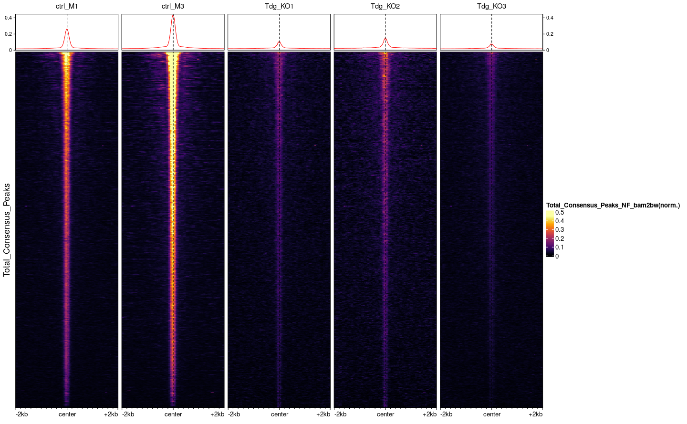
```
Plotting the NFbw coverage to the consensus NFpeaks as normalized EnrichedHeatmap illustrates that the Tdg_KO samples show less accessibility in the regions looked at.

## Discussion

For a long time sperm was known solely as the transmission vehicle of genetic information. With the rise if research in epigenetic/ or non-genetic inheritance, sperm is again focus intensiv investigation.
DNA modifications besides other epigenetic marks is an interesting target to be looked at. In our data we focus on the DNA modificaton 5'-Formylcytosine, which is associated with covalent Histone binding and therefore suspect to be responsible for histone retention. In our samples we have a heterozygous knockout of TDG, the enzyme responsible for the excision of 5fC. In consequence, we would suspect an increase of 5fC in our sperm cells and an acompanying increase of histone retention and reduced accessibility.

The quality control and the mapping rate of our samples lead to the conclusion, that our samples are not of high level quality as recommended by encode. However, this could be a consequence of the special nature of sperm cells. To control for this other published ATAC-seq data for sperm should be checked for its mapping rate and used as control.

Using MAplots to control for signal to noise ratio revealed that when comparing control samples to TDG knockout samples we are confronted with a apparent high technical divergence between knockout and control samples.
This issue could be attenuated when specifically looking at nucleosome-free peaks and nucleosome-free alignments. 

Using the function`plotEnrichedHeatmaps` the total coverage of accessibility was plotted to 5fC peaks. The data revealed that the overall accessiblity is reduced in the Tdg_KO samples. However, these results are inverted when using background normalization. Given the QC results other normalization methods should be used and looked at their biological relevance.

Plotting the full coverage to total consensus NF peaks shows again the reduced accessibility in TDG_KO samples. This data is supported when also looking at the coverage of nucleosome-free coverage. Given the results of the QC of NFpeaks and NFbam/bw files this data plots are more convincing to show actual biological differences between the samples. Nevertheless, further steps should be taken to give results even more support. Various different normalizations methods should be used for further investigation. Samples should be compared to other published sperm ATAC-seq data. 
ATAC sample prepartation and sequencing could be repeated to reduce technical differences. The 5fC content of Tdg knockout sperm could be investigated support the hypothesis that 5fC should be enriched.

## Session Info

```{r}
sessionInfo()
```

## References
